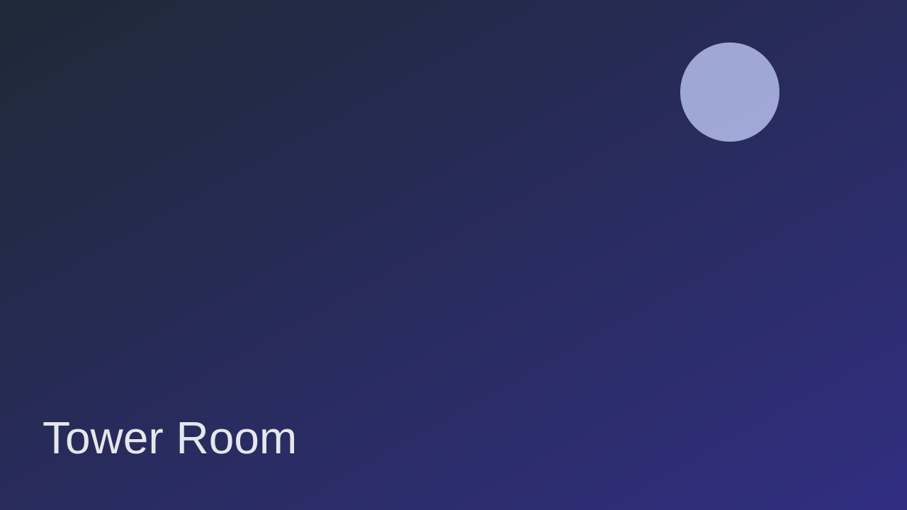

# SESSION_4_STEP_BY_STEP.md
## Intro to Coding — Session 4: Images, Styling, and Atmosphere

In Session 3, your game learned how to remember items and unlock choices.  
In **Session 4**, you’ll make the game feel more cinematic by adding:

- A scene image that changes with the story
- Mood-based styling (calm, danger, mystery)
- UI polish for a more game-like experience

You’ll create **4 files** in this session:
- `index.html` (the page)
- `style.css` (visual style + atmosphere)
- `story.js` (story content + images + mood)
- `script.js` (engine that updates text, choices, image, and mood)

After every step, run the page and look for a visible change.

---

## 🧰 Step 0 — Create Your Session Folder

**What this does for you:**  
Keeps Session 4 separate and organized.

1. Create a folder named:

   `session-4`

2. Open that folder in **VS Code**

3. (Optional but recommended) Create an `assets` folder for images.

---

## 🌐 Step 1 — Create `index.html` (Add Story + Scene Image Area)

**What this does for you:**  
Builds the game layout, including a place for scene images.

1. Create a file named:

   `index.html`

2. Paste this code:

```html
<!DOCTYPE html>
<html lang="en">
<head>
  <meta charset="UTF-8" />
  <meta name="viewport" content="width=device-width, initial-scale=1.0" />
  <title>Choose Your Own Adventure (Session 4)</title>
  <link rel="stylesheet" href="style.css" />
</head>

<body class="mystery">
  <div id="game">
    <h1 id="title">Midnight at Blackstone Keep</h1>

    

    <p id="storyText">Loading story...</p>

    <div id="choices"></div>

    <p id="inventory" class="status">Inventory: (empty)</p>
    <p id="debug" class="status"></p>
  </div>

  <script src="story.js"></script>
  <script src="script.js"></script>
</body>
</html>
```

✅ Run it now.  
You should see: title, image area (or broken image if assets are not added yet), loading text, and status lines.

---

## 🎨 Step 2 — Create `style.css` (Atmosphere + Polish)

**What this does for you:**  
Adds mood, spacing, button styling, and transitions so the game feels alive.

1. Create a file named:

   `style.css`

2. Paste this code:

```css
* {
  box-sizing: border-box;
}

body {
  margin: 0;
  font-family: "Trebuchet MS", Arial, sans-serif;
  display: flex;
  justify-content: center;
  padding: 32px 16px;
  transition: background 0.4s ease;
}

#game {
  width: 640px;
  background: rgba(255, 255, 255, 0.95);
  border-radius: 14px;
  padding: 20px;
  box-shadow: 0 12px 30px rgba(0, 0, 0, 0.25);
}

#title {
  margin-top: 0;
}

#sceneImage {
  width: 100%;
  height: 280px;
  object-fit: cover;
  border-radius: 10px;
  border: 2px solid rgba(0, 0, 0, 0.08);
}

#storyText {
  margin-top: 14px;
  font-size: 18px;
  line-height: 1.5;
}

#choices {
  margin-top: 16px;
  display: grid;
  gap: 10px;
}

button {
  padding: 12px;
  border: none;
  border-radius: 10px;
  font-size: 16px;
  cursor: pointer;
  transition: transform 0.15s ease, opacity 0.15s ease;
}

button:hover {
  transform: translateY(-1px);
  opacity: 0.95;
}

.status {
  margin-top: 12px;
  font-style: italic;
  opacity: 0.85;
}

/* Mood themes */
body.calm {
  background: linear-gradient(135deg, #dbeafe, #f0f9ff);
}

body.mystery {
  background: linear-gradient(135deg, #111827, #312e81);
}

body.danger {
  background: linear-gradient(135deg, #3f0d12, #a71d31);
}

body.calm button {
  background: #0ea5e9;
  color: white;
}

body.mystery button {
  background: #7c3aed;
  color: white;
}

body.danger button {
  background: #ef4444;
  color: white;
}
```

✅ Refresh.  
You should see: a styled game card and color mood in the page background.

---

## 📖 Step 3 — Create `story.js` (Story + Image + Mood Data)

**What this does for you:**  
Stores scene text, choices, inventory behavior, image path, mood per node, and now a code-locked safe with a clue you must discover.

1. Create a file named:

   `story.js`

2. Paste this code:

```javascript
const STORY = {
  start: {
    text:
      "Rain taps against the stone tower windows.\n\n" +
      "A lantern flickers beside a dusty map. The locked door to the hall waits in silence.",
    image: "assets/tower-room.svg",
    mood: "mystery",
    choices: [
      { text: "Take the iron key on the table", target: "start", giveItem: "iron key" },
      { text: "Unlock the hall door", target: "hall", requiredItem: "iron key" },
      { text: "Read the dusty map", target: "map" }
    ]
  },

  map: {
    text:
      "The map shows a hidden route to the courtyard gate.\n\n" +
      "A note in red ink says: 'Only moonlight reveals the safe path.'",
    image: "assets/map-table.svg",
    mood: "calm",
    choices: [
      { text: "Return to the tower door", target: "start" }
    ]
  },

  hall: {
    text:
      "You step into a long hallway lined with portraits.\n\n" +
      "At the end, a staircase leads down. One portrait hangs slightly crooked.",
    image: "assets/hallway.svg",
    mood: "mystery",
    choices: [
      { text: "Inspect the crooked portrait", target: "portrait" },
      { text: "Search the staircase landing", target: "stairLanding" },
      { text: "Take the staircase down", target: "courtyard" }
    ]
  },

  stairLanding: {
    text:
      "You kneel by the stair rail and wipe away years of dust.\n\n" +
      "Scratched into the wood, you find a 4-digit code: 4281.",
    image: "assets/hallway.svg",
    mood: "calm",
    choices: [
      { text: "Return to the hallway", target: "hall" },
      { text: "Go to the portrait safe", target: "safe" }
    ]
  },

  portrait: {
    text:
      "Behind the portrait, you find a small steel safe set into the wall.\n\n" +
      "It needs a 4-digit code.",
    image: "assets/portrait-secret.svg",
    mood: "mystery",
    choices: [
      { text: "Try to open the safe", target: "safe" },
      { text: "Step back into the hallway", target: "hall" }
    ]
  },

  safe: {
    text:
      "The keypad blinks in the dark.\n\n" +
      "Maybe the staircase landing had a useful clue...",
    image: "assets/portrait-secret.svg",
    mood: "danger",
    choices: [
      {
        text: "Enter the 4-digit code",
        target: "hall",
        giveItem: "crest medallion",
        code: "4281",
        codePrompt: "Enter the safe code:",
        codeSuccessTarget: "safeOpened",
        codeFailTarget: "safeLocked"
      },
      { text: "Leave the safe", target: "hall" }
    ]
  },

  safeOpened: {
    text:
      "The lock clicks open.\n\n" +
      "Inside the safe, you secure the crest medallion and hear distant chains rattle below.",
    image: "assets/portrait-secret.svg",
    mood: "calm",
    choices: [{ text: "Return to the hallway", target: "hall" }]
  },

  safeLocked: {
    text:
      "The keypad flashes red and beeps loudly.\n\n" +
      "The safe stays locked.",
    image: "assets/portrait-secret.svg",
    mood: "danger",
    choices: [
      { text: "Try the code again", target: "safe" },
      { text: "Back away to the hallway", target: "hall" }
    ]
  },

  courtyard: {
    text:
      "Cold wind sweeps the courtyard.\n\n" +
      "The main gate is chained shut. A crest-shaped lock sits in the center.",
    image: "assets/courtyard-night.svg",
    mood: "danger",
    choices: [
      { text: "Try the crest lock", target: "gate", requiredItem: "crest medallion" },
      { text: "Go back upstairs", target: "hall" }
    ]
  },

  gate: {
    text:
      "The medallion fits. Chains drop to the ground.\n\n" +
      "The gate opens, and dawn light spills across the road ahead. You escaped Blackstone Keep.",
    image: "assets/gate-open.svg",
    mood: "calm",
    choices: [
      { text: "Play again", target: "start" }
    ]
  }
};
```

✅ Refresh.  
You should still see loading text until the engine reads this file in the next step.

---

## ⚙️ Step 4 — Create `script.js` (Render Text, Choices, Image, and Mood)

**What this does for you:**  
Runs the game, tracks inventory, swaps scene images, applies mood classes, and supports code-locked choices.

1. Create a file named:

   `script.js`

2. Paste this code:

```javascript
const bodyEl = document.body;
const storyTextEl = document.getElementById("storyText");
const choicesEl = document.getElementById("choices");
const sceneImageEl = document.getElementById("sceneImage");
const inventoryEl = document.getElementById("inventory");
const debugEl = document.getElementById("debug");

const state = {
  inventory: []
};

function hasItem(itemName) {
  return state.inventory.includes(itemName);
}

function addItem(itemName) {
  if (itemName && !hasItem(itemName)) {
    state.inventory.push(itemName);
  }
}

function renderInventory() {
  inventoryEl.textContent =
    state.inventory.length > 0
      ? `Inventory: ${state.inventory.join(", ")}`
      : "Inventory: (empty)";
}

function applyMood(mood) {
  bodyEl.classList.remove("calm", "mystery", "danger");
  bodyEl.classList.add(mood || "mystery");
}

function goToNode(nodeId) {
  const node = STORY[nodeId];

  if (!node) {
    storyTextEl.textContent = "Oops! That page does not exist yet.";
    choicesEl.innerHTML = "";
    debugEl.textContent = `Missing node: ${nodeId}`;
    return;
  }

  storyTextEl.innerHTML = node.text.replaceAll("\n", "<br>");
  sceneImageEl.src = node.image || "assets/tower-room.svg";
  sceneImageEl.alt = `Scene: ${nodeId}`;
  applyMood(node.mood);

  choicesEl.innerHTML = "";

  node.choices.forEach((choice) => {
    if (choice.requiredItem && !hasItem(choice.requiredItem)) {
      return;
    }

    const button = document.createElement("button");
    button.textContent = choice.text;
    button.onclick = () => {
      if (choice.code) {
        const entered = window.prompt(choice.codePrompt || "Enter code:");
        if (entered === null) return;

        if (entered.trim() !== String(choice.code)) {
          goToNode(choice.codeFailTarget || nodeId);
          return;
        }

        if (choice.giveItem) {
          addItem(choice.giveItem);
        }

        goToNode(choice.codeSuccessTarget || choice.target);
        return;
      }

      if (choice.giveItem) {
        addItem(choice.giveItem);
      }
      goToNode(choice.target);
    };

    choicesEl.appendChild(button);
  });

  renderInventory();
}

goToNode("start");
```

✅ Test the code-locked safe interaction:

- Go to the hallway
- Click **Search the staircase landing** to discover the code
- Go to the portrait safe
- Enter a **wrong code** and confirm you go to the fail step
- Enter the **correct code (4281)** and confirm you go to the success step and get the crest medallion

---

## 🚀 Next Steps

- Experiment with your own story, images, and styles.
- Add sounds or music for more atmosphere.
- Create more complex puzzles or branching paths.

---

## 🎉 Conclusion

You've completed Session 4! Your game now has:

- Dynamic images that change with the story
- Atmospheric styling that reflects the mood
- Polished UI elements for a better player experience

In the next session, you'll learn about adding sounds and music to enhance your game's atmosphere.
